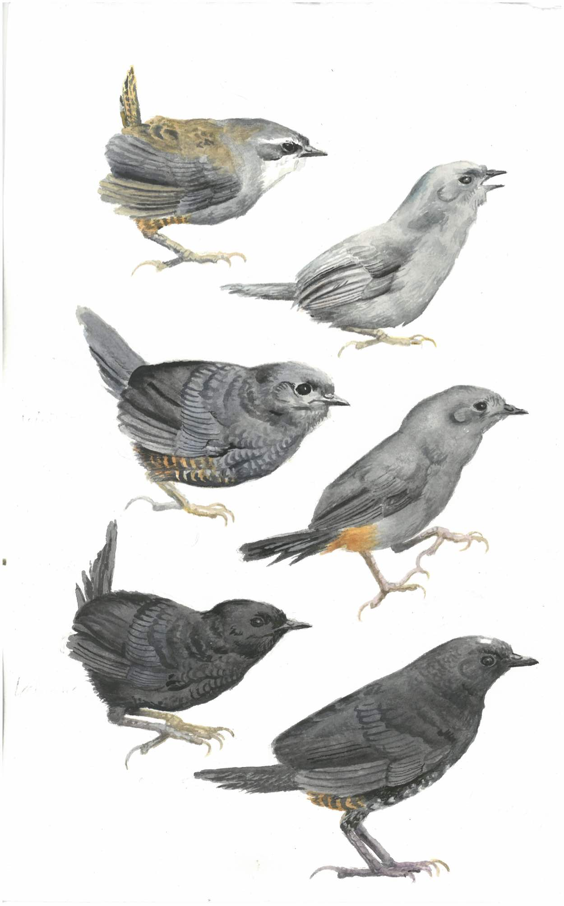

# Introduction

This repository contains data and results of studies on phylogenetics and elevational distributions of birds in the genus *Scytalopus*.

The molecular datasets were used for analyses of phylogeny and diversification in:

    Cadena, C. D., A. M. Cuervo, L. N. Céspedes, G. A. Bravo, N. Krabbe, T. S. Schulenberg, 
    G. E. Derryberry, L. F. Silveira, E. P. Derryberry, R. T. Brumfield & J. Fjeldså. 2020. 
    Systematics, biogeography and diversification of Scytalopus tapaculos (Rhinocryptidae), 
    an enigmatic radiation of Neotropical montane birds. The Auk 137: 1-30. 10.1093/auk/ukz077
    

Data on elevational distributions were analyzed in:

    Cadena, C. D. & L. N. Céspedes. 2020. Origin of elevational replacements in a clade of nearly 
    flightless birds: most diversity in tropical mountains accumulates via secondary contact 
    following allopatric speciation. Pp. 635-659 in: Rull, V. & Carnaval, A. (eds.), 
    Neotropical Diversification: Patterns and Processes. Springer Nature Switzerland.
    
# Data

**DNA Sequence Data**

We constructed phylogenies of most *Scytalopus* and their near relatives using sequences of a total of 1,246,332 base pairs of nuclear DNA sequences corresponding to regions flanking 1,833 ultra conserved elements (UCEs; 1,201,528 bp) and 80 exons (44,804 bp). The file `aligment_subset_fasta-zip` contains alignments for each of these regions which we used to construct phylogenies in concatenated and species-tree analyses. Raw data will be made available once a large-scale project on the phylogeny of suboscine birds led by M. Harvey et al. is completed.

We also conducted phylogenetic analyses based on sequences of the mitochondrial ND2 gene for close to 300 specimens. The file `Scytalopus309_ND2-definitiveV_GenBank.fasta` contains the ND2 alignment we employed for analyses aimed at reconstructing phylogenetic relationships using maximum-likelihood and Bayesian inference in RAxML and MrBayes, respectively. The file `Scyt90_forBeast_definitive_GenBank.fasta` corresponds to the aligment we employed to construct a BEAST tree for 90 tips, which we used in diversification analyses. Individual ND2 sequences were also submitted to GenBank.

**Elevational Distributions**

The file `Scytalopus_ElevationData_47taxa.csv` contains minimum and maximum elevation for the 47-taxa dataset described in the manuscript. The file `Scytalopus_ElevationData_57taxa.csv` contains minimum and maximum elevation for the 57-taxa dataset, as well as information on the specimens used to construct the phylogeny based on ND2 mitochondrial sequences, and the name with which each taxon is labeled on the tree in Figure 3.

# Results

**Tree files**

The tree files resulting from our phylogenetic analyses are labelled as in the Figures in the Auk paper. Trees labelled with the prefix `Fig. 2` were obtained using ASTRAL and RAxML analyses of the nuclear data. `Fig. 3` corresponds to trees obtained using RAxMLand MrBayes analyses of the mitochondrial data. `Fig. 4` corresponds to the BEAST tree with 90 tips used for diversification analyses.

**High-resolution Figures**

Unfortunately, the figures in our Auk 2020 paper were reproduced at low resolution by the publisher despite our repeated requests to not do so. High-quality images can be downloaded from this [folder](https://github.com/cdanielcadena/Scytalopus/tree/master/figures).

----

**Watercolor by John Fjeldså**
